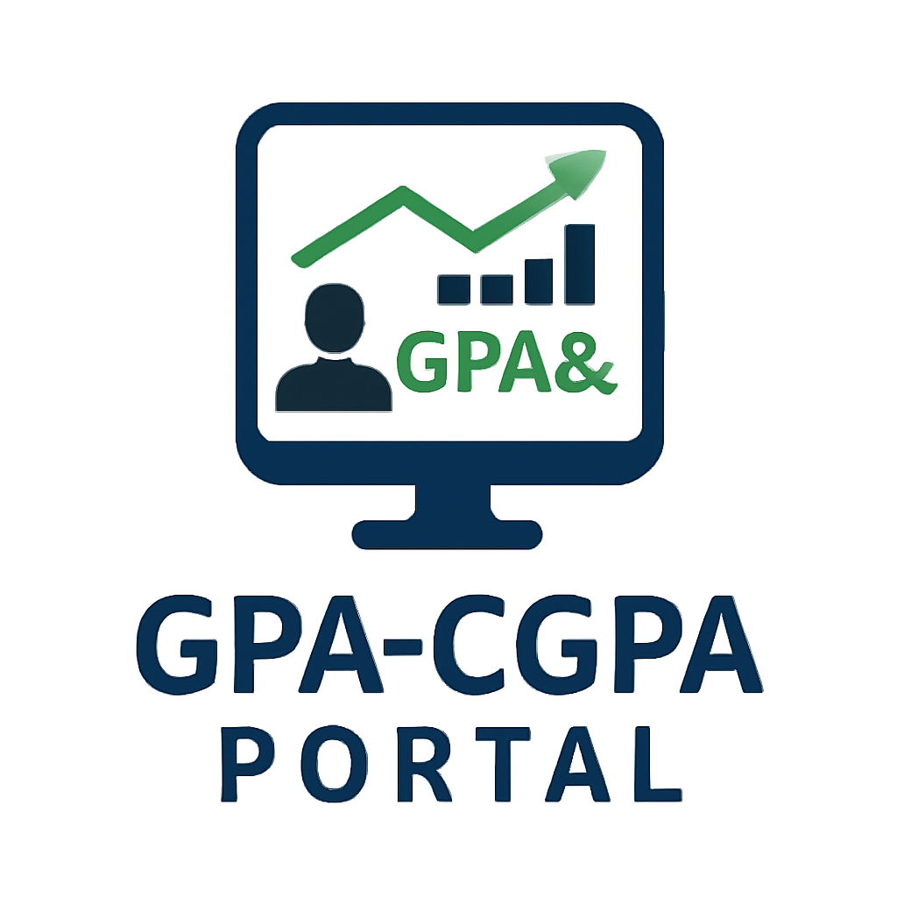
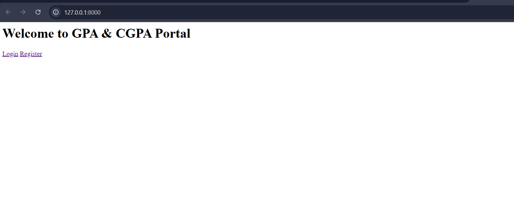
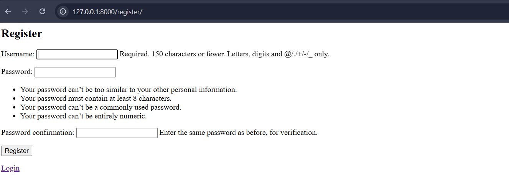
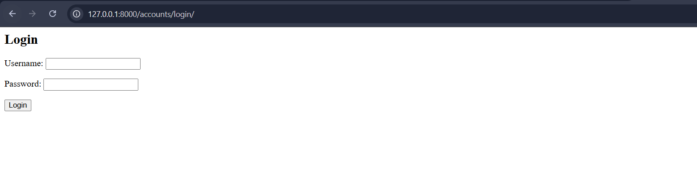
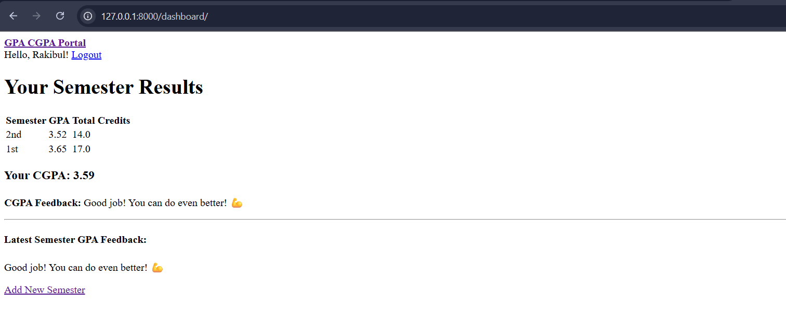

<p align="center">
  
</p>

<h1 align="center">GPA & CGPA Portal 🎓</h1>

A Django-based GPA & CGPA calculator portal where students can input semester-wise subject grades, automatically compute GPA and CGPA, and receive performance feedback. Built with a clean UI and a focus on academic insights.

---

## 📑 Table of Contents

- [Features](#features)
- [Getting Started](#getting-started)
- [Screenshots](#screenshots)
- [Credits](#credits)
- [License](#license)

---

## Features

- 🔐 User registration and authentication
- 📝 Add semesters with multiple subjects
- 🧮 GPA calculation per semester
- 📊 CGPA calculation across all semesters
- 💬 Smart academic feedback based on performance
- 🎨 Clean Bootstrap-powered UI
- 🛠 Admin dashboard for testing and control

---

## Getting Started

### 1. Clone the Repository

```
git clone https://github.com/RR0327/GPA-CGPA-Portal.git
cd GPA-CGPA-Portal
```

### 2. Create Virtual Environment

````
python -m venv venv
venv\Scripts\activate  # On Windows
# OR
source venv/bin/activate  # On macOS/Linux
````

### 3. Install Dependencies

```
pip install -r requirements.txt
```

### 4. Apply Migrations

```
python manage.py makemigrations
python manage.py migrate
```

### 5. Create Superuser (Optional)

```
python manage.py createsuperuser
```

### 6. Run the Development Server

```
python manage.py runserver
```

Visit the portal at: [http://127.0.0.1:8000](http://127.0.0.1:8000)

---

## Screenshots

### Home-page


### Register-page


### Login-page


### User Dashboard with GPA & CGPA Overview


---

## Credits

Built using Django by **Md Rakibul Hassan**
*CSE Undergraduate | Backend Developer | Robotics & IoT Enthusiast*

🔗 [LinkedIn](https://www.linkedin.com/in/md-rakibul-hassan-507b00308)

🐙 [GitHub](https://github.com/RR0327)

Designed to help students calculate, visualize, and reflect on their academic performance through an intuitive GPA & CGPA tracking portal.

---

## License

This project is open source and available under the [MIT License](LICENSE).

---